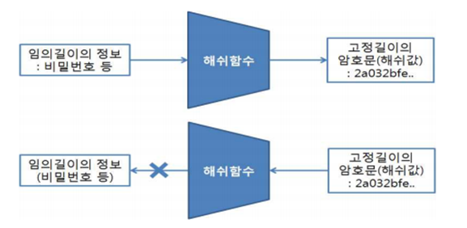
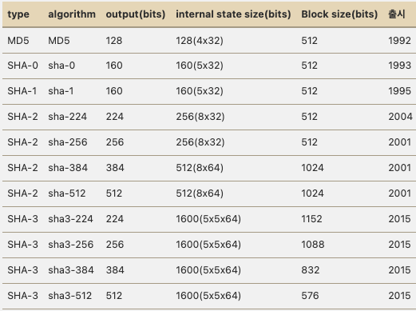
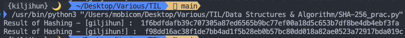
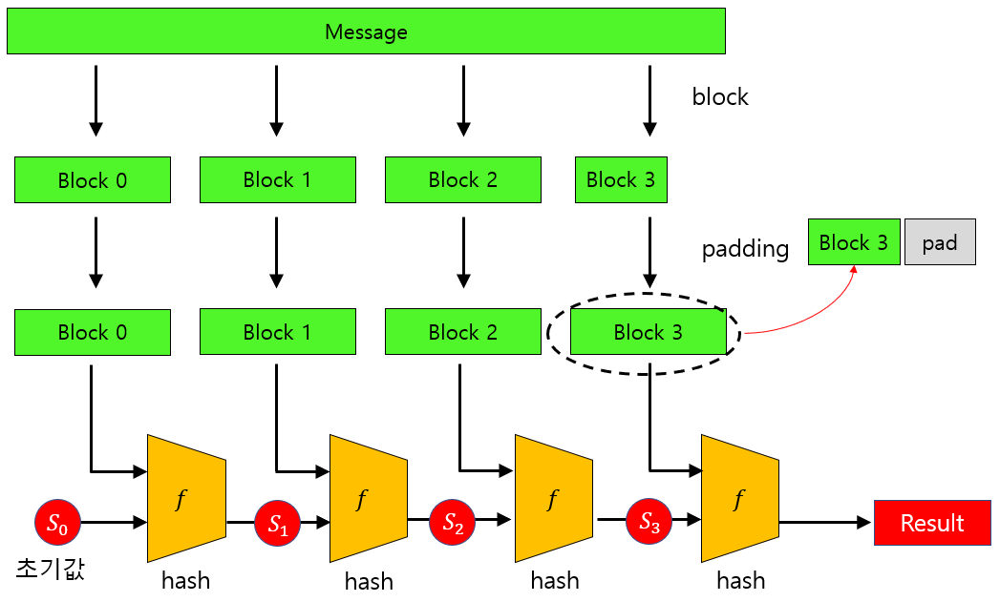
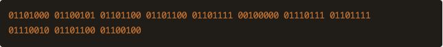
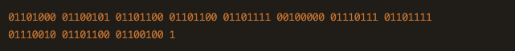
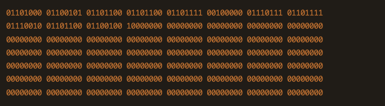
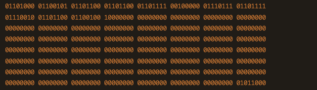

# SHA-256 해시 알고리즘

## 1. 해쉬 함수란?

 
임의의 길이를 가진 메시지를 해시함수에 입력하면 256bit와 같은 고정 길이의 해시값을 출력한다.
해시값을 다시 해시함수에 넣기 전인 원래의 메시지로 돌아갈 수 없다는 점이 특징이다.  

> 
즉, 암호된 문장(해시값)으로부터 원문(입력값)을 얻을 수 없다.

## 2. 역사

SHA란 **Secure Hash Algorithm**.  

  
미국 국가안보국(NSA)가 1993년 설계, 미국 국가 표준으로 지정됨.    

최초의 함수 'SHA-1'. 이후 'SHA-2, 224, 384, 512' 등등 여러 알고리즘이 발표됨.

  

 아무튼 위와같은 여러 해시 알고리즘 중 SHA-256에 대해 알아보자!

## 3. SHA-256

SHA-256은 메시지, 파일, 혹은 데이터 무결성 검증 등 널리 사용되는 암호화 해싱 알고리즘(함수)이다.  
변환을 원하는 문자들을 256 bit 길이의 key로 변환한다.
문자가 조금만 바뀌어도 해시값이 완전히 변한다!

## 4. 직접 해보기(with.Python)

파이썬 hashlib 라이브러리를 통해 직접 해싱을 할 수 있다.

> **코드**
~~~python
import hashlib

target1 = "giijihun"
result1 = hashlib.sha256(target1.encode()).hexdigest()
print("Result of Hashing - [giljihun] : ",result1)

target2 = "giijihun!"
result2 = hashlib.sha256(target2.encode()).hexdigest()
print("Result of Hashing - [giljihun!] : ",result2)
~~~
> **출력**  

> target1과 target2는 느낌표 하나 차이이지만 해싱 결과는 완전히 다르다.

## 5. SHA-256의 과정
다음과 같은 대략적인 과정을 따른다고 한다!
> 1. 전처리 - 문자열을 패딩하고 작은 블록으로 나누고, 초기 값을 설정한다.
> 2. 해시 계산 - 여러 연산을 통해 256비트의 해시값을 계산한다.

자세히 살펴보겠다.

  

**~ 아래 내용은 직접 위 예제로 어떻게 과정을 직접 보는 지 잘 모르겠어서 
블로그 내용에서 발췌하였습니다. (글 마지막에 링크첨부) ~**
### (1) 타겟 문자열을 바이너리의 형태로 변환한다. -> 0, 1  
예를 들어, 'a'라는 문자는 '010000001'이라는 기계어로 변환되며,
아래처럼 "hello world"라는 문자열은 88bits 바이너리 코드로 변환 된다!

### (2) 바이너리 데이터는 512 비트의 블락들로 나뉜다.  
만약, 블락이 512보다 작다면 패딩을 통해 사이즈를 늘려주고  
더 크다면 512비트에서 자름!! 

먼저, 기존 88bits 바이너리 코드에 1을 붙인다. (89비트가 됨)  

    
 
OK, 그리고 위 코드는 512 비트보다 작으니까 패딩을 해줌!!   

여기서 마지막 64비트를 제외하고 모두 0으로 채워준다!

  

그러면 위처럼 마지막 64비트를 제외했으므로 448비트가 된다.  
(8비트로 이루어진 바이너리 코드가 총 8*7 = 56개 -> 448비트)

  

그리고 마지막 64비트는, 원래 문자열의 길이를 big endian 정수로 나타낸다. 
본 예제의 "hello world"는 88비트였기 때문에 88이라는 정수를 big endian 방법으로 바이너리 코드를 추가해준다!! (* 88 - 1011000)
> **Big endian** : 데이터를 표현, 저장하는 방법으로 다중 바이트 데이터를 메모리에 저장할 때 바이트의 순서를 설명하는 용어이다. 빅 엔디언 방식은 가장 높은 주소에 가장 중요한 바이트를 저장한다!! 내림차순으로. <-> 리틀 엔디언 - 가장 낮은 주소에 가장 중요한 바이트가 저장.

### (3) 앞서 512비트로 나눈 블락들을 다시 32비트로 자른다.  

### (4) 압축 함수를 64회 반복 수행한다.  

### (5) 이후 각 블락별로 해시값을 구하는데, 첫번째 블락의 해시 결과가 두번째 블락의 입력값으로 사용된다!!! 두번째 블락의 해시 결과는 첫번째 블락의 해시 결과와 두번째 블락 데이터와 결합해서 구해진다.  

### (6) 최종적으로 256비트의 해시값이 생성된다...! (매우 긴 여정) 
이것이 SHA-256 결과값.

## 6. SHA-256의 안정성

만약 무한대의 시간이 있다면 SHA-256을 해킹할 수도 있다고 하지만, 아직까지 아무도 해내지 못했다고 한다.  
그리고 해시 충돌면에 있어서도 아직까지 충돌 사례가 없다고 한다..!  

**Therefore, 현재 비트코인 네트워크와 같이 세계적으로 사용중이라고 한다.**

> **[참고 문서] : [로스카츠의 AI 머신러닝][link]**  

[link]: https://losskatsu.github.io/blockchain/sha256/#4-sha-256-%EA%B3%BC%EC%A0%95