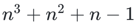
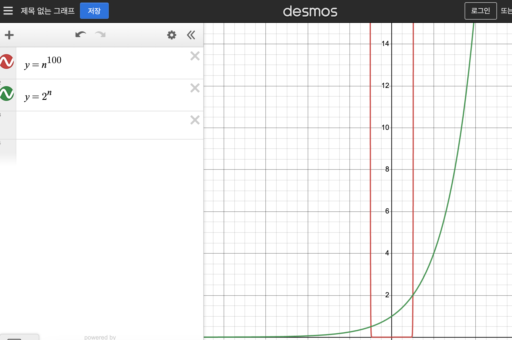

# 점근적 표기법

- 점근적 : 점점 가까워지다.
- 소규모 횟수로는 극명한 차이를 나타내지 못한다.
- 값이 클수록 큰 차이를 보여준다.
- 즈가율에 따라 변화되는 양을 표기
- 알고리즘 수행시간에 대한 복잡도 계산

## 
본래 점근적 표기법은 수학적인 개념이라 엄밀한 정의를 설명하려면 수학적 지식이 필요하지만, 간단하게 개념을 이해할 수 있는 수준으로 설명하겠음!  

점근적 표기법에는 크게 **O, Ω, Θ**가 있다!!  
각각 **빅-오, 빅-오메가, 빅-세타**라고 부른다! 

간단한 다항식 예제로 이해해보자  

## O(빅-오) 는 가장 높은 차수 보다 같거나 높은 식을 뜻한다

즉, 위 식에서 $n^3$이 가장 높은 차수이므로, 
$O(n^3), O(n^5), O(n^(100))$ 모두 맞는 말.   

앞으로 이러한 식을 보면 
우리는 $O(n^3)$라고 부르면 된다.
이때 표현은 $n^ 
3
 +n^ 
2
 +n−1=O(n^ 
5
$
) 와 같이 나타낼 수 있습니다.

만약 $f(n)=n^ 
3
 +n^ 
2
 +n−1,  g(n)=n^ 
5$
  이었다면, $f(n)=O(g(n))$ 으로도 나타내 볼 수 있습니다.   
이는 $f(n)$의 차수가 $g(n)$의 차수보다 같거나 작다는 의미를 갖습니다.

## Ω(빅-오메가)는 가장 높은 차수 보다 같거나 낮은 식을 뜻한다

Ω는 가장 높은 차수 보다 같거나 낮은 식을 뜻합니다.
즉, $n^3 + n^2 + n − 1$에서 가장 높은 차수는 $n^3$
  이므로 $Ω(n^3), Ω(n), Ω(logn)$ 모두 맞는 말이 된다!

## Θ는 최고차항(가장 높은 차수)을 뜻한다
즉, $n^3+n^2+n−1$에서 가장 높은 차수는 $n^3$
  이므로 $Θ(n^3)$이 됩니다.

## Side Note #1
**$n^(100) = O(2^n)$ -----> 참인가?**

참이다.  

n이 커짐에 따라서, $2^n$ 값이 훨씬 커지기 때문에 모든 지수승으로 이루어져있는 식은 전부 다항식보다 크다고 할 수 있다!!

> 그래프 그려봤는데 나중에 가면 거의 동일해진다.

https://www.codetree.ai/missions/6/problems/usage-of-time-complexity?&utm_source=clipboard&utm_medium=text

~~~
! ! 대략 포문이 1억번 도는데, 1초가 걸린다는 점을 기억하자  ! !
~~~