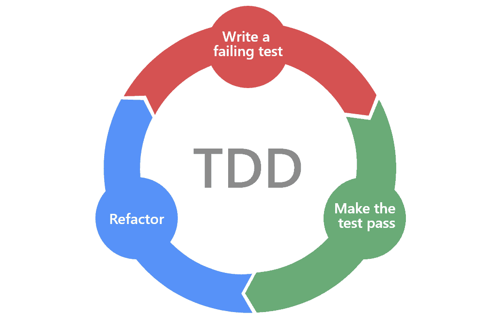

# TDD(Test Driven Development)
### 2023-08-14

>테스트 주도 개발.

~~~
말그대로 테스트를 중요시하는 개발 방법론.
[작은 단위의 테스트 케이스를 작성 -> 이를 통과하는 코드를 추가]의 과정을 반복
~~~

~~~
짧은 개발 주기를 반복함에 의존하는 개발 프로세스.
프로그래밍 전에 테스트 코드를 먼저 작성하는 특징이 있음.
~~~

~~~
[Red = fail test] 단계 : 실패하는 테스트 코드를 먼저 작성.
[Green = pass test] 단계 : 테스트 코드를 성공시키기 위한 실제 코드를 작성.
[Blue = refactor] 단계 : 중복 코드 제거, 일반화 등의 리팩토링 수행.
~~~

> 기대효과 : 실제 코드의 기대되는 바를 명확하게 정의하여 불필요한 설계를 피하고, 정확한 요구 사항에 집중.

~~~
장점
1) 재설계 시간 단축
2) 기능별 모듈화
3) 추가 요구사항 반영이 비교적 쉬움
4) 디버깅 시간 단축

단점
1) 낮은 생산성 (테스트코드를 추가적으로 개발해야됨.)
2) 초기 세팅 비용 높음
3) 숙련자용
4) 기한이 한정적이면 본 프로세스 채용이 어려움.
