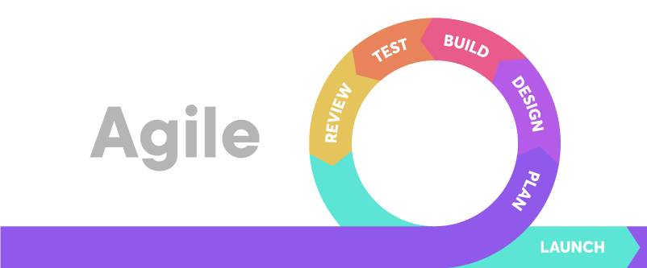
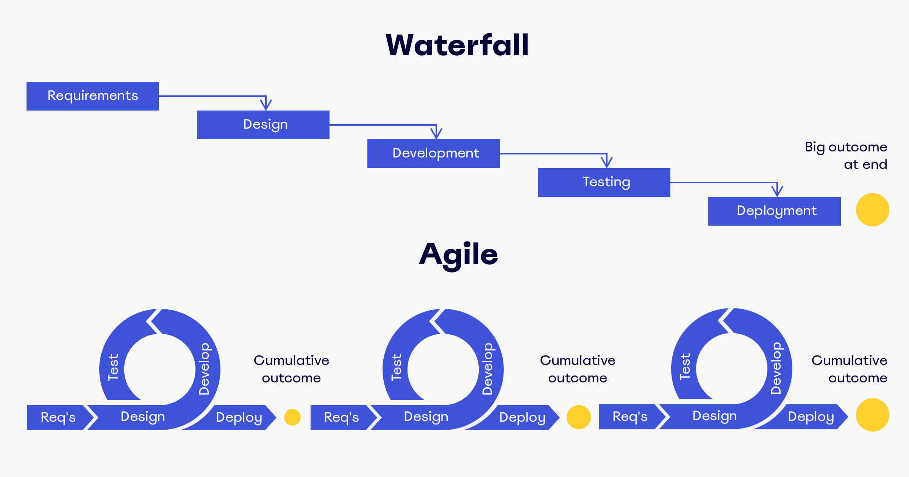
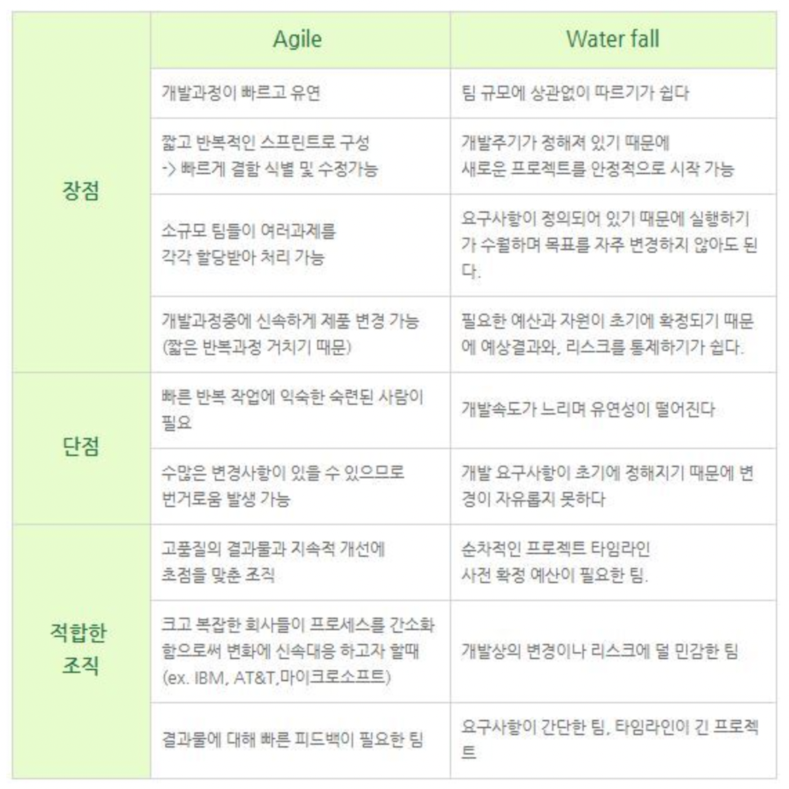

# 애자일 방법론이란?
### 2023-08-14

~~~ 
개발 공부를 하거나 지나가면서 가끔 보게되는 '애자일', '애자일 패턴', '애자일 방식' 등등.. 그래서 한 번 정리해보게되었다.

Let's go Agile!
~~~

~~~
'애자일(Agile)'은 소프트웨어 개발 방식 중 하나이다.

작업 계획을 짧은 단위로 세우고 제품을 만들고 고쳐 나가는 사이클을 반복함으로써 고객의 요구 변화에 유연하고도 신속하게 대응하는 개발의 방법론이다.
~~~
~~~ 
Agile = '기민한, 날렵한'

좋은 것을 빠르게 취하고, 유연, 효율적으로 개발하도록 하는 다양한 방법론을 통칭해 일컫는 말이라고 한다. (뭔가 말장난같은데 그렇다고 한다.)
~~~

~~~
애자일 프레임워크
: 애자일 방법론을 따르는 개발 기법 
ex) Scrum, kanban, XP(eXtreme Programming) etc..
~~~

~~~
애자일은 어떠한 규정이나 툴이 아니다.
약간 관점, 가치관, 문화라고 생각하면 됨.
~~~
~~~
'애자일 소프트웨어 개발 선언문' 이라는 것도 있음.
↓↓↓↓↓
~~~
>http://agilemanifesto.org/iso/ko/manifesto.html

# 왜 애자일이 중요하고 실사용되는가

~~~
애자일의 탄생 배경에는 워터폴(Waterfall) 방식이라는게 있다.
~~~

~~~
사실 프로젝트의 진행 순서는 동일하다.
~~~
>주문 ➪ 디자인 ➪ 기능구현 ➪ 테스팅 ➪ 배포
~~~
하지만 애자일 패턴은 기능을 아주 작게 축소하고 이 한 사이클이 빠르게 돌게 하는 것이 포인트이다. 그래서 중간 테스트(피드백)을 많이 가질 수 있다는 점.

여기서 그 한 주기 = 스프린트(Sprint)
~~~

> 둘다 장단점이 명확한데 개인적으로 애자일이 올바른 방식인거같은 느낌?
