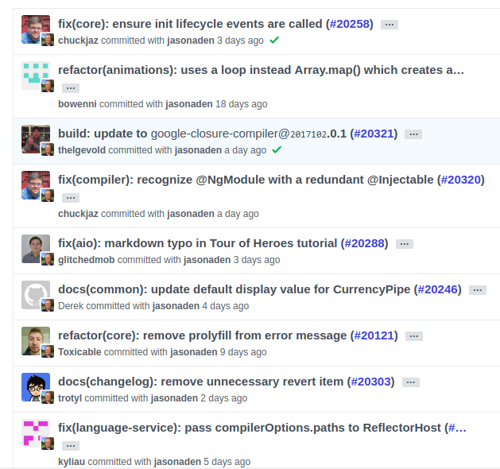

# 코드 컨벤션

> '코드 컨벤션'이란 읽고 관리하기 쉬운 코드를 작성하기 위한 일종의 코딩 스타일 규약

```
컨벤션을 만드는 경우의 이점
- 과거 코드에 대한 코드 추적
- 이슈 사항 처리 상황
- 팀원들과의 커뮤니케이션
```

```
일관성 없음 -> 비효율

Right ?
```

# 좋은 커밋 메시지를 위한 규칙들

> 중요한 것 네이밍을 명시적이고 규칙적으로 작성

## 일반적인 커밋 메시지의 7 규칙

> 1. 제목과 본문을 빈 행으로 구분.
> 2. 제목을 50글자 이내로 제한.
> 3. 제목의 첫 글자는 대문자로 작성.
> 4. 제목의 끝에는 마침표 X.
> 5. 제목은 명령문으로. 과거형 X.
> 6. 본문의 각 행은 72글자 내로 제한.
> 7. 어떻게 보다는 무엇과 왜를 설명.

## 커밋 메시지 예시

```
Feat: In Timer! 백그라운드 기능 추가(#123)

Start를 누른 상태에서 백그라운드 진입 시, 알림을 받을 수 있게 합니다.
 - background.swift: 구분 코드

해결: close #123
```

## 커밋 메시지 구조

```
$ <type>(<scope>): <subject>    -- 헤더
  <BLANK LINE>                  -- 빈 줄
  <body>                        -- 본문
  <BLANK LINE>                  -- 빈 줄
  <footer>                      -- 바닥 글

간단하게 보면 아래처럼

type: Subject

body

footer

```

> \<body>는 본문으로 헤더에서 생략한 상세한 내용을 적는다.
>
> > 헤더로 충분히 표현이 된다면 생략이 가능하다.
> >
> > > \<footer>는 바닥글로 어떤 이슈에서 왔는지와 같은 참조 정보를 추가하는 용도로 사용한다.
> > >
> > > > 예를들어 특정 이슈를 참조하기 위해서 close #321와 같이 사용하면 된다. 해결(이슈 해결 시 사용)/관련(해당 commit에 관련된 이슈 번호)/참고(참고할 이슈가 있는 경우 사용)의 타입을 사용하여 작성한다.

```
<type> 종류

feat : 새로운 기능에 대한 커밋
fix : build 빌드 관련 파일 수정에 대한 커밋
build : 빌드 관련 파일 수정에 대한 커밋
chore : 그 외 자잘한 수정에 대한 커밋(기타 변경)
ci : CI 관련 설정 수정에 대한 커밋
docs : 문서 수정에 대한 커밋
style : 코드 스타일 혹은 포맷 등에 관한 커밋
refactor : 코드 리팩토링에 대한 커밋
test : 테스트 코드 수정에 대한 커밋
```

## 실무 예시 사진


