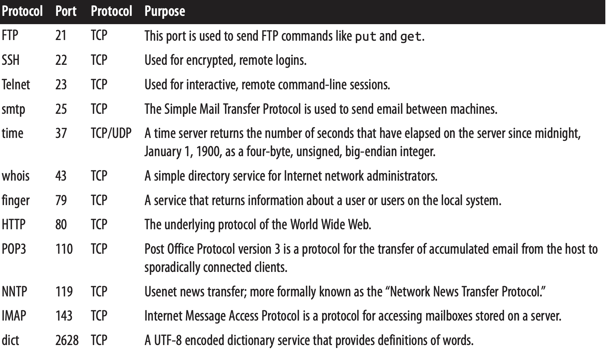
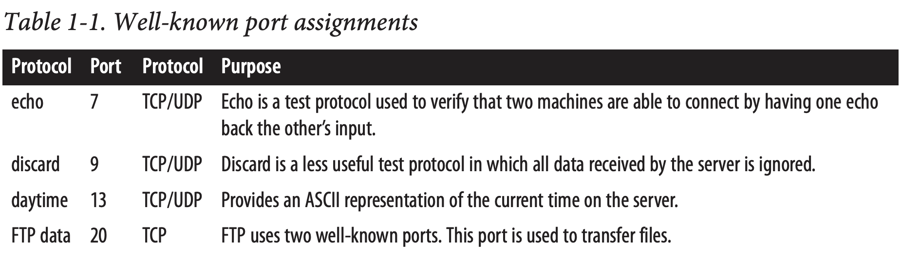
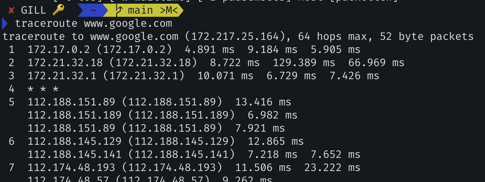
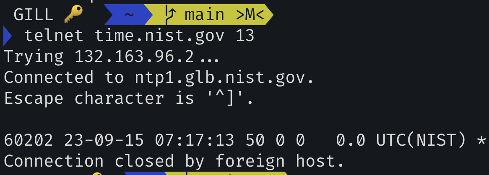
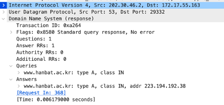
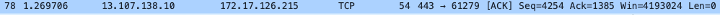
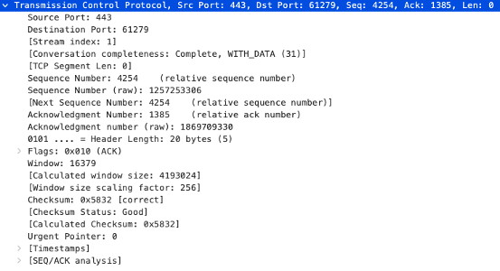
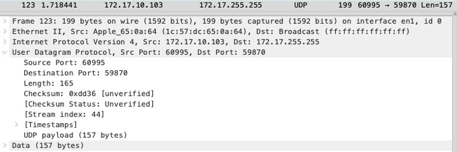

# 3주차

## The Internet Layer

The Internet Protocol (IP) is the most widely used network layer protocol in the world and the only network layer protocol Java understands.

: IP는 세계에서 가장 널리 사용되는 네트워크 레이어 프로토콜이고 자바가 이해하는 유일한 네트워크 레이어 프로콜이다. (3계층)

IPv4 : 32 bits

IPv6 : 128 bits

90퍼센트 이상은 여전히 IPv4를 사용중이다.

## The Transport Layer

The transport layer is responsible for ensuring that packets are received in the order they were sent and that no data is lost or corrupted. If a packet is lost, the transport layer can ask the sender to retransmit the packet.

Transport layer는 패킷이 순서대로 받는 것을 보장한다. 

(순서를 맞추기 위해서 헤더에 시퀀스 넘버가 존재한다.)

(ex. #1 - 100 bytes, #2 - 101 bytes ... )

(ex. #1 - 100 bytes, #101 - 1000 bytes ...)

Transmission Control Protocol (TCP), is a high-overhead protocol that allows for retransmission of lost or corrupted data and delivery of bytes in the order they were sent.

TCP는 오버헤드가 빈번한 프로토콜이다. 

유실되거나 손상된 데이터의 재전송과 전달받은 순서대로 바이트의 전달을 허용하기 때문에.

the User Datagram Protocol (UDP), allows the receiver to detect corrupted packets but does not guarantee that packets are delivered in the correct order (or at all)

UDP는 손상된 패킷 감지는 허용한다. 그러나 올바르 패킷의 순서는 보장하지 않는다.

 However, UDP is often much faster than TCP.  

그러나 UDP는 훨씬더 TCP보다 빠르다. 

TCP is called a reliable protocol; UDP is an unreliable protocol.

신뢰 vs 불신 프로토콜.

Later, you’ll see that unreliable protocols are much more useful than they sound.

그러나 매우 유용해. (빨라서.)

## The Application Layer

(5계층)

일반적으로 프로그램을 짠다는 것은 5계층의 어플리케이션을 짠다는 내용.

사실 아래 계층의 프로토콜은 어떻게 돌아가는지 몰라도됨..

## IP Addresses and Domain Names

**dotted quad format** like 199.1.32.90

근데 이런 숫자는 기억하기가 쉽지 않음...

그래서 -> **Domain **을 만들어서 기억하기 쉽게함!(like Naver.com)

그래서 내가 어떤 네임을 입력했을 때 이걸 알려주는 서버가?

-> DNS(Domain Name System) 서버라고 한다.

최초의 IP랑 DNS 서버를 알려주는 것이?

-> **DHCP 서버.**

그럼 DHCP 서버는 어떻게 찾나??

-> 장치가 연결되면 Brodcast 방식으로 메시지를 보냄(공유기 역할)

IPv4 addresses beginning with 127 (most commonly 127.0.0.1) always mean the local loopback address.

255.255.255.255, is a broadcast address

-> 전체에게 뿌릴 때 사용. (DHCP서버를 찾을 때.)

## Ports

포트번호 -> 4계층과 5계층 사이에서 어플리케이션을 구분하는 번호.

modern computers do many different things at once. 

현대 컴퓨터는 한번에 다른 많은 작업을 한다.

Email needs to be separated from FTP requests, which need to be separated from web traffic. This is ac‐ complished through ports.

##### 

Traceroute : 몇 번의 홉을 하는 지 추적.

TTL을 이용해서 1일 때 , 2일 때, ... 쭉쭉 Reply를 받는 방식이다.

4 -> * * * 은 리플라이를 해주지 않은 경우이다.  

daytime 프로토콜을 사용한 예제. 

## Internet Address Blocks

## Network Address Translation

= 공유기, IP 주소를 공유함.

 
외부에 있는 IP 주소 하나를 가지고 IP 주소는 같고, 공유기를 거쳐서 해당하는 컴퓨터들에게 연결해줌.

## Internet Standards

Although there are many standards organizations in the world, the two that produce most of the standards relevant to application layer network programming and protocols are the Internet Engineering Task Force (IETF) and the World Wide Web Consortium (W3C).

--------------
--------------
--------------

## 과제

### 1. DNS 패킷 wireshark로 확인하기
DNS 패킷 포맷을 찾아보고, www.hanbat.ac.kr 에 대한 DNS query 패킷과 response 패킷을 wireshark으로 캡쳐해서 DNS 패킷 포맷의 필드의 값 확인하기.

Transaction ID 가 0xa264로 쌍으로 맺어졌다는 것을 알 수 있다.

Question에 대해 response가 Answer를 준다. -> addr : 223.194.192.38

DNS로 물어봤던, www.hanbat.ac.kr의 주소를
캐시로 저장하고 1 day간 가지고 있겠다는 뜻.
-> 내부 저장된 것을 사용한다.

### 2. TCP Header, UDP Header 포맷을 찾아보고, wireshark에서 TCP 와 UDP 패킷을 1개  캡쳐해서 Header의 필드 값을 확인하시오.

 

TCP, UDP에 대해선 따로 다루는게 좋을듯

### 3. RFC time protocol, daytime protocol 을 설명하시오. (RFC 번역 또는 요약설명 할것)

>“RFC 868 – Time Protocol”

이 프로토콜은 ARPA(Advanced Research Projects Agency) 인터넷의 호스트 시스템들이 구현할 수 있는 시간 정보를 제공하기 위한 표준을 정의한다. 

기계가 읽을 수 있는 형식으로 날짜와 시간 정보를 제공한다. (1900년 1월 1일 자정부터 몇 초가 경과했는지를 나타내는 값을 32비트 바이너리 숫자로 반환한다.)

TCP, UDP를 통해 사용될 수 있음. 
     TCP : 연결을 맺고 시간 값을 보내고 연결을 종료한다.
     UDP : 빈 데이터그램을 보내고 시간 값을 담은 데이터그램을 반환한다.

> “RFC 867 – Daytime Protocol”

이 프로토콜은 ARPA 인터넷의 호스트 시스템들이 구현할 수 있는 Daytime Protocol의 표준을 정의한다.

Daytime Protocol은 현재 날짜와 시간을 문자열 형태로 보내며, 입력에 관계없이 단순히 현재 시간 정보를 제공한다. 또한 유용한 디버깅 및 측정 도구로 사용된다. 

TCP : 서버는 포트 13에서 TCP 연결을 수신
UDP : 포트 13에서 UDP 데이터그램을 수신

Daytime 프로토콜은 특정 문법 정의가 되어있지 않음. ASCII 인새 가능 문자, 공백, 캐리지 리턴 및 라인 피드로 제한하는 것이 권장. 보통 “Weekday, Month Day, Year Time-Zone” 혹은 ”dd mmm yy hh:mm:ss zzz”와 같은 형식으로 현재 시간을 나타낸다.

~~~ 
RFC에 대해서도 따로 다루면 좋을듯
~~~
