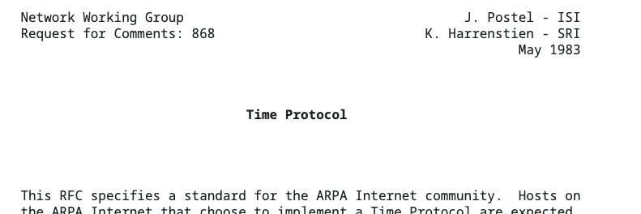

# RFC (Request for Comments)

> 많이 중요한 지식?은 아니라고 생각이 들어서 짧게 정리
~~~
RFC는 Request for Comments의 약자인데, 직역하면 "의견을 남기기를 요청함!" 이다.

미국의 국제 인터넷 표준화 기구인 IETF(Internet Engineering Task Force)에서 제공, 관리하는 문서이다.

인터넷 개발에 있어서 필요한 기술, 연구 결과, 절차 등을 기술해놓은 메모를 나타낸다.

거의 모든 인터넷 표준은 항상 RFC로 문서화가 되어있고, 인터넷 개발에 관련된 기술을 연구하거나 알고있는 사람은 누구나 RFC 문서를 작성할 수 있다.

일련의 단계를 통과하면 IETF에서 문서에 번호를 붙여주게 된다. (RFC *** 이런식) 검토 등을 통해 문서에 대한 신뢰가 높아지면 해당 RFC에 번호를 붙이는데, 이런 과정을 거쳐서 표준이 된다고 보면된다.
~~~
> 예시(RFC 868 - Time Protocol)

> [참고문서] - https://net-study.club/entry/RFC-Request-for-Comments%EB%9E%80-RFC%EC%9D%98-%EC%97%AD%EC%82%AC-RFC-%EC%A2%85%EB%A5%98-RFC-%ED%91%9C%EC%A4%80%ED%99%94-%EC%A0%88%EC%B0%A8

위 링크로 가보면 역사나 표준화 절차도 나와있으니 참고바람.