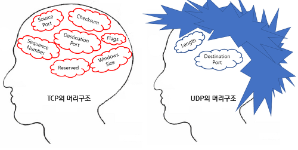
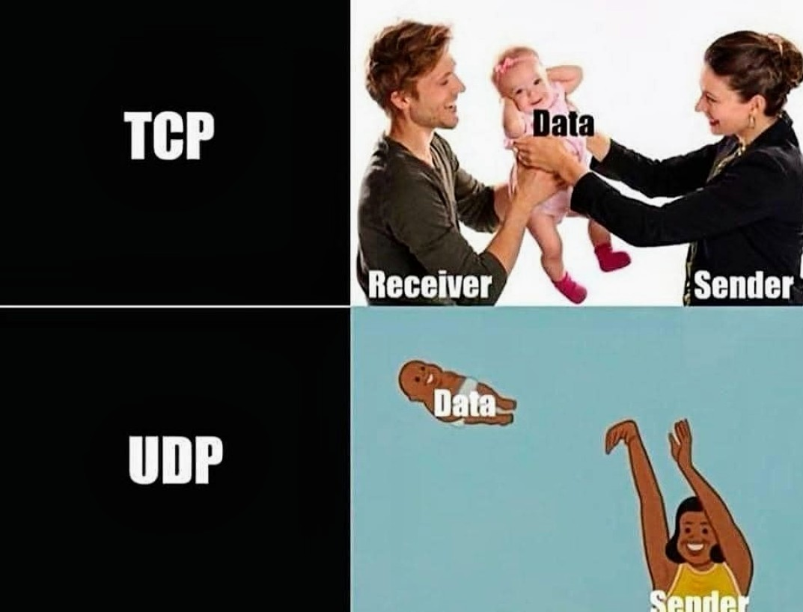
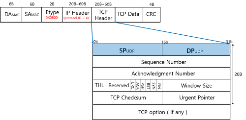
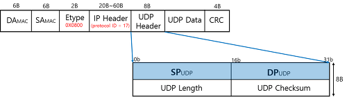

# TCP vs UDP

> 아 이거 정리하려고 인터넷 찾는데 진짜 웃겨죽는줄 알았다 ㅋㅋ 좀따 첨부사진들 참고

TCP/UDP란 대표적인 전송 프로토콜 2인방이다. (통신방식이라고 하면 될듯)

TCP : 데이터 전송의 신뢰를 보장.
UDP : 데이터 전송의 신뢰를 보장하지 않지만 처리 속도가 빠름.

사진을 보면 (ㅋㅋ)
TCP는 기본적으로 담고있는 데이터량이 훨씬 많다. 그에 반해 UDP는 Length와 DST port만 알고있음.

TCP : 패킷 수신이 원활하게 이루어짐 
 
UDP : 중간에 유실, 손상이 이루어질 수 있음.

but, TCP는 일반택배. UDP는 당일퀵배송.

이해쏚쏙?

## TCP와 UDP 헤더를 통해 비교

~~~
일반적으로 네트워크 통신에서 데이터는 패킷에 담겨 전송된다.

이 패킷의 크기는 여러 요소에 따라 결정되지만, 일반적으로 네트워크에서 사용되는 이더넷과 같은 프로토콜에서는 패킷의 최대 크기가 제한된다. 

이 제한된 크기를 최대 전송 단위(MTU, 
Maximum Transmission Unit)라고 한다.

일반적으로 이더넷의 MTU는 1500바이트가 표준이다. (한 번의 패킷에 최대 1500바이트까지만 담길 수 있다는 것.)
-> 그래서 여러개의 패킷으로 분할되어 전송되어야 한다.

,,but 다른 네트워크 프로토콜이나 특정 구성에 따라 MTU가 다를 수 있음.
~~~

자 이제 예시를 통해 한 번 보자.

> 한밭대 컴퓨터공학과 MT에 총 200명의 학생이 간다.   
근데 한 버스에 최대 탑승 가능 인원이 30명이라, 여러대의 버스를 대여하고 버스 앞에 한밭대 컴공과라고 적어 놓고 같은 일행임을 표시함.
 
-> 여기까지가 기본적으로 TCP, UDP에 주어지는 네트워크 환경.
 
하지만 둘은 앞서 본 것처럼 구조가 다르기 때문에 버스 status를 다르게 관리함.

### TCP 헤더

출발지/목적지 포트 정보 외에 여러 정보를 가지고 있음. 이 여러 정보들은 버스가 정상적으로 모두 도착했는 지를 확인하는 내용임.

1호 버스 도착.  
3호 버스 도착, 근데 학생 한 명이 없다. 재확인 하고 다시 오길 바람.  
2호 버스 왜 아직 안오지?  
- 2호 버스 재촉 -  
2호 버스 도착.  
3호 버스 도착.  
" 모두 정상 도착 확인 "
  

> 정확하지만, 처리속도가 느릴 수 밖에 없음

### UDP 헤더

출발지/목적지 정보를 Main으로 확인.
1호, 2호, 3호 버스 이런 개념 없음.

> 버스가 도착했는지 확인 안하기 때문.  
그래서 정확도는 낮지만 처리속도가 아주 빠름.

> [참고문서] https://run-it.tistory.com/20