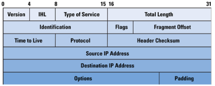
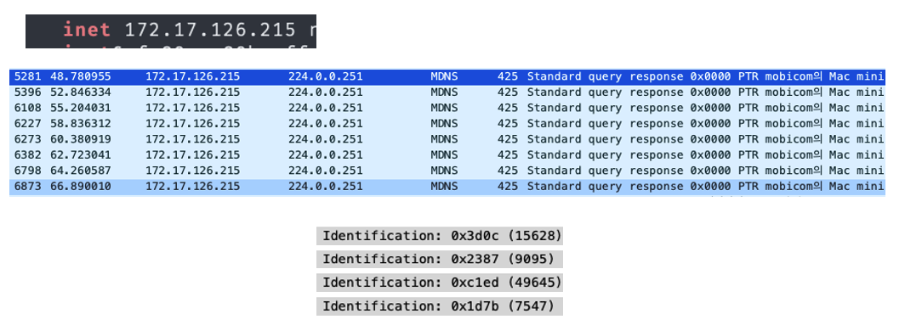
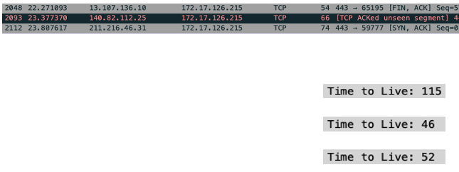
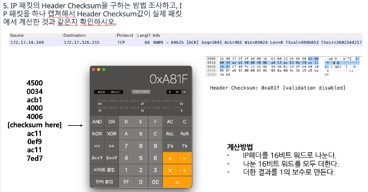

## Basic Network Concepts
~~~ 
- Network Programming은 더이상 특정 전문가의 영역이 아니다.
- 모든 개발자들에게 중요한 부분이 되었다.
- Java는 네트워크 어플리케이션을 위해 기초부터 설계된 첫번째 언어이다. (자바로 하는게 쉽다고함)
~~~

> FTP servers : File Transfer Protocol.  
> 파일 수신, 전송, 삭제, 디렉토리 생성 또는 제거 등과 같이 원격 클라이언트가 제공한 명령을 실행할 수 있는 하나 이상의 프로그램으로 구성된 컴퓨터 소프트웨어

## Networks

~~~
- 네트워크는 거의 실시간으로 데이터를 주고 받을 수 있는 컴퓨터와 다른 장치들의 집합이다.
- 각각 장치들의 네트워크는 'node(노드)'라고 불린다. (컴퓨터일 수도 있고, 컴퓨터가 아닐 수도 있다.)
- 노드들 중에 완전 컴퓨터같은 노드들은 'hosts(호스트)'라고 불린다. (General - purpose computer)
- 모든 네트워크 노드는 'address(주소)'를 가진다. (주소는 노드들을 특정시킨다.) 
- 모든 현대 컴퓨터 네트워크는 패킷-스위치 네트워크이다.
(패킷-스위치 네트워크 : 데이터를 작은 패킷으로 나누어 여러 경로를 통해 독립적으로 전송하고, 최종 목적지에서 다시 원래의 데이터 스트림으로 재조립하는 방식의 네트워크.)
- 프로토콜은 컴퓨터들이 통신을 하기위한 정밀한 형식이나 규칙이다.
~~~

> IPv4 : 32bits (현재 보편적으로 사용)  2의 32승, 대략 40억 가량의 컴퓨터를 구분이 가능하다는 의미도 된다.
>
> ++ 근데 40억개면 전세계 컴퓨터를 다 처리할 수 있나??? -> 안됨! 이미 IPv4의 신규할당은 끝났다.
>
> ​	그래서 현재 '공유기'가 보편적으로 잘 쓰이고 있다.
>
> IPv6 : 128bits 
> DHCP(동적 호스트 구성 프로토콜) : 자동으로 IP (인터넷 프로토콜)를 호스트 하는 IP 주소 및 서브넷 마스크 및 기본 게이트웨이 등의 기타 관련된 구성 정보를 제공 하는 클라이언트/서버 프로토콜
> Router : 데이터 패킷을 전송하는 네트워크 장치
>
> Routing : 라우팅은 어떤 네트워크 안에서 통신 데이터를 보낼 때 최적의 경로를 선택하는 과정(어디로 가는게 빠를지)  
> 
> 패킷 교환 (Packet switching) : 작은 블록의 패킷으로 데이터를 전송하며 데이터를 전송하는 동안만 네트워크 자원을 사용하도록 하는 방법  
> 
> HTTP(Hypertext Transfer Protocol) : 웹 페이지를 다른 페이지로 연결하는 링크

## The layers of a Network

**각 계층 are called by**

~~~ 
5: Application

4: Transport 
(TCP, 패킷에 헤더(번호)를 붙이는 역할 -> 유실된 패킷이나 순서의 오류를 해결, 신뢰성good, header byte - 20byte)
(UDP, 패킷을 그냥 던지고 끝 뭐 재전송하거나 맞추거나 하는 기능 X, header byte - 8byte)
(요새 트렌드, UDP로 빠르게 통신하고 Application 계층의 프로토콜에서 불완전한 부분을 처리)
(여기 프로토콜들을 'end-to-end'라고 부른다)

* TCP의 헤더가 붙는 방식
#1, #101, #1101 ...

3: internet or network (IP, 라우팅을 위한 프로토콜, 패킷이 목적지까지 잘 찾아가게 만드는 역할)

2: Data Link (서로 데이터가 충돌이 안나게 데이터를 전송하는 역할) [통신 방식]

1: Physical layer [통신 방식]
~~~

### TCP

* Connection-Oriental : 연결 지향
* 3 - way handshake : 데이터를 주고 받는데, 3번 과정이 필요 (왜 필요한가?)
  1. initial sequence number를 설정한다 (시작 포인트를 맞춘다.)
  2. OK?
  3. OK!

-> 양쪽 모두 데이터를 전송할 준비가 되어있다는 것을 보장하고, 실제로 데이터 전달이 시작하기 전에 다른 한쪽이 준비되었다는 것을 알 수 있도록 해준다.

-> UDP는 이런거 없다.(but, 매우 빨라.)

-  대부분 패킷이 45로 시작한다.(IPv4에서 Header Length가 5 이므로)

  4(IPv4)와 5가 합쳐져서 45이다.

### Port Number 

* 어플리케이션을 구분하는 용도가 포트번호이다.
* IP에서 TCP로 올린 입장에서, TCP는 이 패킷이 어느 어플리케이션으로 가야할 지를 결정해야한다..
* 그것을 결정하는 것이 Port Number이다.
* 유명한 프로토콜은 모두 고유한 퐅넘.이 있다.
* 나머지들은 임의로 랜덤하게 할당을 해준다.(컴퓨터가 안쓰는 거로 해줘.)

### IP Header

IP 헤더는 20 바이트를 사용한다.  0 ~ 40 -> X

## 과제
~~~ 
1. IP 패킷 하나를 캡쳐해서 IP Header의 필드 값의 의미와 대응하는 값을 확인하시오. 
~~~

(+ 황교수님 맥스튜디오 캡쳐했다.)

> - IP 헤더의 첫 번째 바이트 ‘45’  
-> ‘4’ : IP 버전 (4 -> IPv4)  
-> ‘5’ : IP 헤더 길이 (20 / 4 = 5), 이것이 프로토콜(약속)이다. (나는 5라고 보내지만 곱하기 4를 한 값으로 생각하시오.)
-> 이 값은 4비트로 표현되며, 헤더의 길이를 32비트 단위로 나타낸다.  
-> 5 X 32(비트) / 8(비트)  = 20바이트  
> - IP 헤더의 나머지 부분에는 출발지 IP 주소, 목적지 IP 주소, TTL (Time To Live), 프로토콜, 헤더 체크섬 및 기타 중요한 정보가 포함된다. 

~~~
2. 내 컴퓨터에서 보내는 IP 패킷들을 순서 대로 여러 개 캡쳐하고 Identification 필드의 값은 어떻게 변하는지 확인하시오.
~~~

> "Identification" 필드는 패킷의 일련 번호를 나타내며, 패킷이 생성될 때마다 다른 값을 가질 수 있습니다.  
> 패킷 생성기나 송신 소프트웨어에서 이 값을 설정하지 않는 한, 이 필드는 시스템이나 하드웨어에서 자동으로 증가되거나 무작위로 설정됩니다.

~~~
3. 내 컴퓨터가 보내는 IP 패킷들의 TTL 값은 고정인가? 
~~~

-> 동일했다!

> - TTL (Time To Live) 값은 패킷이 네트워크를 통과할 때 감소하는 값입니다. 제가 이전 답변에서 언급한 것처럼, TTL 값은 패킷이 라우터를 통과할 때마다 1씩 감소하게 됩니다. 이것이 TTL의 주요 기능 중 하나로, 패킷이 네트워크를 이동하면서 TTL 값이 줄어들다가 0이 되면 패킷이 폐기되는 것을 방지합니다.

> - TTL 값이 255로 설정된 패킷이 목적지에 도달하면, 해당 패킷이 255개의 라우터를 통과할 수 있다는 것을 의미합니다. 각 라우터를 지날 때마다 TTL 값이 1씩 감소하므로, 패킷이 최종 목적지에 도달하기 위해서는 255번의 라우터 통과를 허용하는 것입니다.

~~~
4. 내 컴퓨터가 수신한 IP 패킷의 TTL 값은 얼마인가? 보낸 상대방 IP 주소가 다를때 TTL 값을 3개 이상 확인하시오. 
~~~

~~~
5. IP 패킷의 Header Checksum을 구하는 방법 조사하고, IP 패킷을 하나 캡쳐해서 Header Checksum값이 실제 패킷에서 계산한 것과 같은지 확인하시오. 
~~~
> Hedaer Checksum은 IP 헤더의 오류 검출을 위해 사용된다.

1. IP 헤더 추출.
2. Header Checksum 필드를 제외한 Checksum을 계산.
3. Checksum 계산순서  
(1) IP 헤더를 16비트 단위로 나눈다.  
(IP 헤더는 여러필드로 구성되어 있고, 각 필드는 16비트 크기를 가진다.)  
(2) 다 SUM한다.  
(3) 더한 결과 값이 16비트 범위를 벗어나면, 오버플로우된 부분을 다시 더해준다.  
(오버플로우된 비트를 추가하여 계산한다.)  
(4) 최종적으로 얻은 값을 16비트로 나타내고, 1의 보수를 취한다.
=> 1의 보수를 취하는 이유, 받는 쪽에서 체크섬을 포함해서 쫙 더해서 모든 자리가 1이 나오게 하기 위함!(편하게)
=> 그 당시에는, 하드웨어로 체크섬을 검사했음. 그래서 행정절차 간소화(?)가 무조건 효율!
=> Checksum 값이 된다.
=> 상당히 허술하다. 더해서 1만 나오면 돼서..

> 솔직히 이렇게 할 필요 없고 그냥 계산기 두드려라!

------------------------------------------------------

<과제 설명 내용>

- 이더넷 헤더 -> 6bytes
- TOS : Type of Service, 마치 편지처럼. 빠르게 가는 패킷과 느리게 가도 되는 패킷을 구분하고 싶었다.
  근데 현대 사회에서는 모든게 빠르게 가게 하기 때문에 현재 사용하지 않는다. (그래서 00).
- Total length : 전체 패킷의 길이(데이터 까지 다 ~) (렝스를 16비트까지 한 이유 : 대강 65000개까지 가능할거같아서)
- Identification : 패킷의 번호, 대부분 순서대로 온 패킷은 1씩 증가한 값을 가진다.

패킷을 fragmentation 한다 -> 오버헤드 발생 가능성 급증, 손실의 우려 급증

파편화된 패킷을 받고 합칠 때 -> ID, Fragment offset을 이용해서 조합.
=> 하지만 일반적인 상황에서 파편화 할 이유가 없다. 왜냐면 이미 TCP에서 내려올 때 쪼개져서 내려온다.
=> 이미 잘게 파편화되어있기 때문에 IP층에서 파편화 시킬 이유가 없음.

- TTL (Time To Live) 값은 패킷이 네트워크를 통과할 때 감소하는 값입니다. 제가 이전 답변에서 언급한 것처럼, TTL 값은 패킷이 라우터를 통과할 때마다 1씩 감소하게 됩니다. 이것이 TTL의 주요 기능 중 하나로, 패킷이 네트워크를 이동하면서 TTL 값이 줄어들다가 0이 되면 패킷이 폐기되는 것을 방지 + 무한루프 방지. (근데 많아봤자 20 ~ 30개의 라우터만 돈다.)
