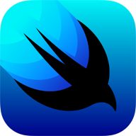

# 🔎 TIL

Today I learned (feat. Gil)
제발 매일 올리자!  

###  [Markdown 문법 정리](./markdownGRAMMAR.md)

## Development Process

- [애자일(Agile)](<./DevelopmentProcess/애자일(Agile).md>)
- [TDD](./DevelopmentProcess/TDD.md)

## Data Structures & Algorithm
- [점근적 표기법](./Data%20Structures%20&%20Algorithm/점근적%20표기법.md)

## iOS

- [iOS 앱 버전 업데이트하기](./iOS/iOS%20앱%20버전%20업데이트하기.md)

## GIT

- [효율적인 Commit 규칙](./GIT/효율적인%20Commit%20규칙.md)

## Network Programming

- [RFC(Request for Comments)](./Network%20Programming/RFC.md)
- [TCP vs UDP](./Network%20Programming/TCP%20vs%20UDP.md)
- [DHCP](./Network%20Programming/DHCP.md)

### 수업&과제 내용 정리
- [2주차](./Network%20Programming/2주차.md)
- [3주차](./Network%20Programming/3주차.md)
- [4주차](./Network%20Programming/4주차.md)

## Mobility SW/AI

- [Vehicle Communications and Networks](./Mobility%20SW%20and%20AI/Vehicle%20Communications%20and%20Networks)

- [Computer Vision](./Mobility%20SW%20and%20AI/Computer%20Vision)

##  SwiftUI

- [3D 애니메이션](./SwiftUI/[SwiftUI]%203D%20애니메이션.md)

