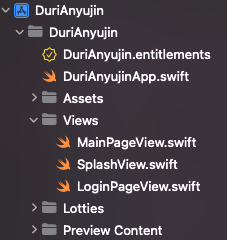
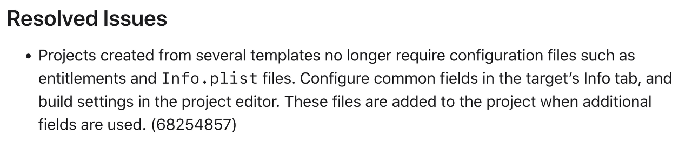
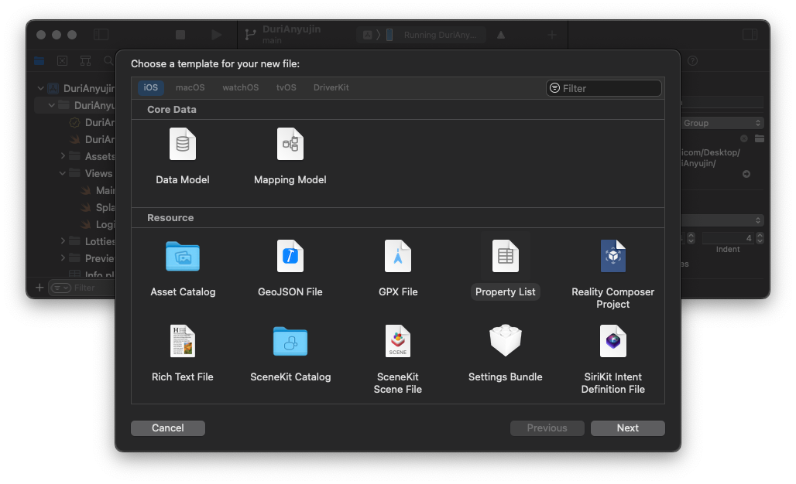
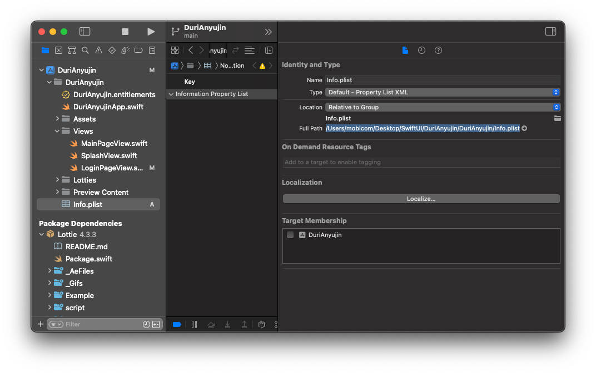
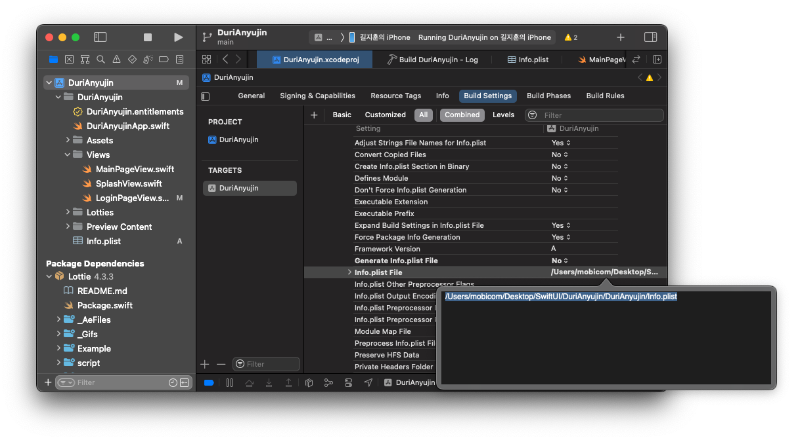

# Xcode에서 Info.plist가 없을때 해결하기
가끔 iOS 관련 블로그들을 뒤적뒤적 하면서 기능구현을 하려고 하면  
오늘의 주인공 >> Info.plist << 얘를 신나게 다들 조작하는게 보인다.

오잉? 없는데.........

찾아보니 SwiftUI 프로젝트를 Xcode 13에서 생성하면 info.plist 파일이 없다고 한다...

> 여러 템플릿에서 생성된 프로젝트에는 더 이상 사용 권한 및 Info.plist 파일과 같은 구성 파일이 필요하지 않습니다.

> 대상의 정보 탭에서 공통 필드를 구성하고 프로젝트 편집기에서 설정을 작성합니다. 이 파일들은 추가 필드가 사용될 때 프로젝트에 추가됩니다.

라고 하는데.. 대충 Target의 Info 탭에 통합해놨고, 더 필요한게 있으면 프로젝트에 추가해서 쓰셈 ㅇㅇ.

### 본론

## 1. 먼저 'Info' 라는 이름으로 Xcode에 새로운 Info.plist를 만들어준다.

***주의, 이게 절대 끝이 아니니까 마지막까지 봐야 오류가 없어요 !!!***

## 2. Info.plist가 존재하는 위치(Build Path)를 긁어옵니다.

## 3. Project - Targets - Build Settings - Info.plist File를 찾아서 붙여넣기

바로 위에 있는 Generate Info.plist File 도 No.로 해줍시다
  

자 여기까지 했으면 ***"This is to prevent a "Multiple ..."*** 뭐머머 오류가 뜨겠죠.

## 4. 기존 Info.plist 제거

저기 +를 누르라는게 아니고, 여기에 Info.plist가 있을건데 그걸 삭제해주세요. 

## 5. LET'S BUILD.

**빌드 하면 끝!**

  
   
     

[참고 자료] https://blog.naver.com/PostView.naver?blogId=soojin_2604&logNo=222713573559