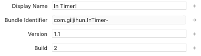
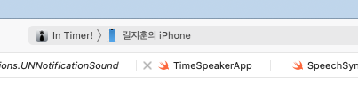
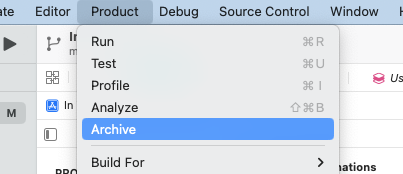
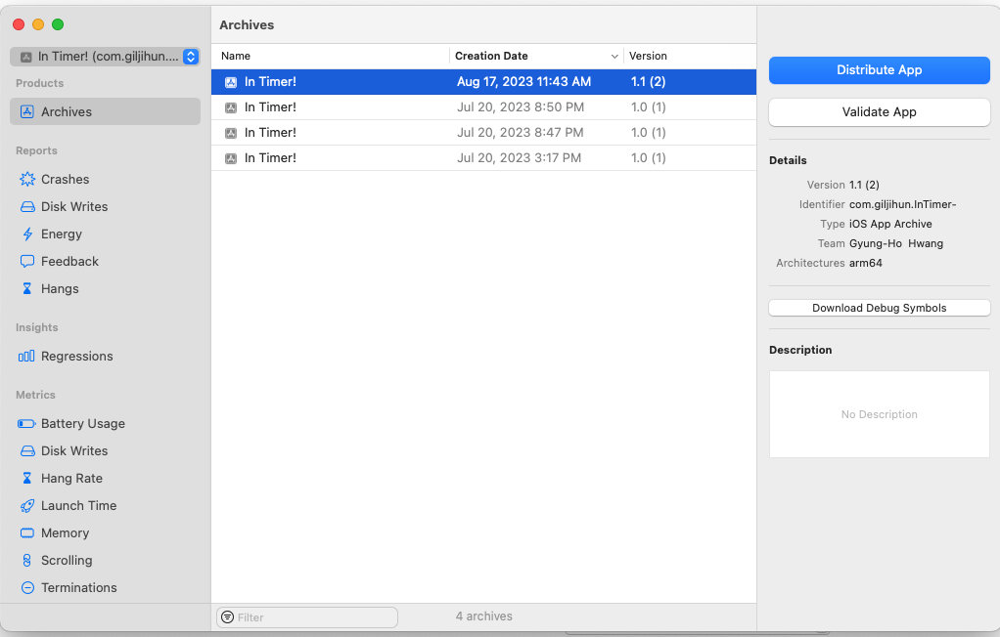
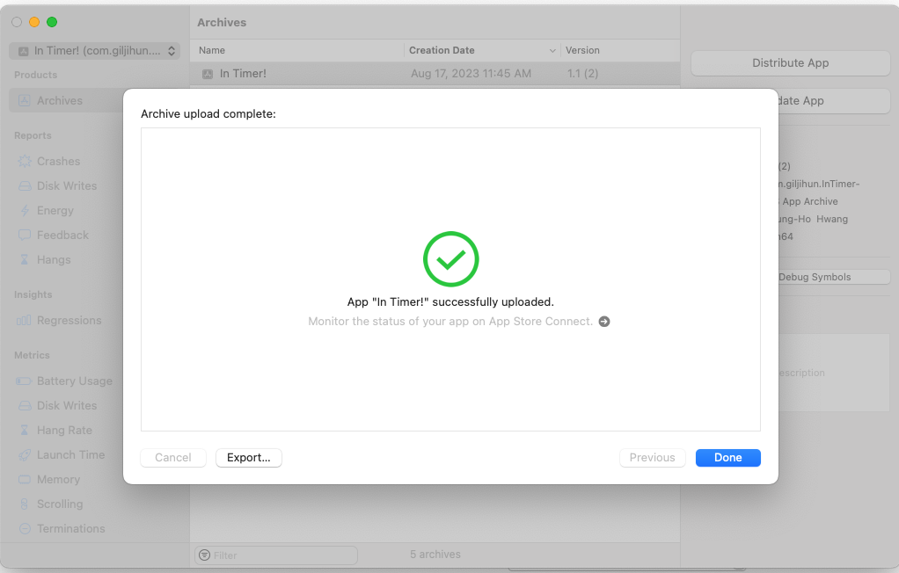
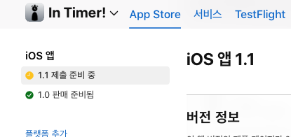
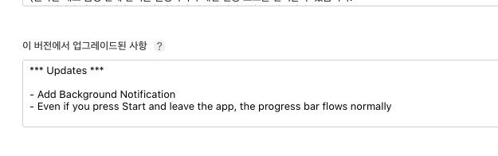
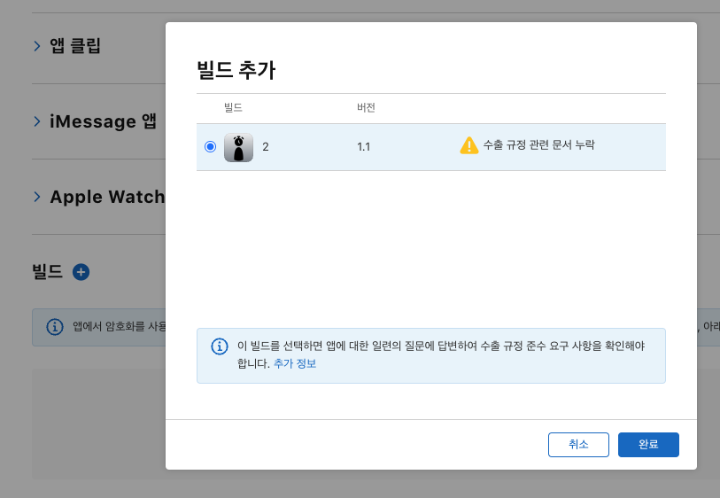

## iOS 앱 버전 업데이트하기
### 2023.08.17.

> 앱은 그 상태로 종결될 수도 있지만, 버그나 신규 기능 추가 등의 이유로 업데이트가 필요하다.

> 내 간단 인터벌 타이머 앱인 'In Timer!'의 신규 버전 업데이트 하려다가 생각나서 씀

##

1.  


먼저 Project 아이콘을 눌러서 본인 General 설정에 들어가자.

들어왔으면 버전이 기존에 1.0 이런식일텐데, 본인이 원하는 번호로 교체를 해주자.

빌드 번호도 하나 올려주자.

```
버전 번호 (Version Number): 버전 번호는 앱의 큰 변경 사항을 나타냅니다. 예를 들어, 1.0, 2.0과 같은 형태로 구성됩니다. 이 값은 사용자에게 주요한 업데이트나 기능의 추가를 의미합니다.
```

```
빌드 번호 (Build Number): 빌드 번호는 각각의 앱 빌드를 식별하기 위한 번호입니다. 버전 번호가 같더라도 빌드 번호가 다르면 앱 스토어에 업로드할 수 있습니다. 또한, 버그 수정, 작은 변경 사항, 성능 향상 등과 같은 빌드 업데이트를 식별하는 데 사용됩니다.
```

> 앱을 업데이트할 때 빌드 번호를 증가시키지 않으면, 앱 스토어가 해당 빌드를 새로운 것으로 간주하지 않을 수 있습니다. 따라서 사용자에게 업데이트가 있는 것으로 표시되지 않을 수 있습니다. 빌드 번호를 증가시켜야 앱 스토어가 새로운 버전으로 간주하고 업데이트 알림을 보여줄 수 있습니다.

    결론 : 빌드 번호 증가시키고 버전 번호도 증가시키자.

#

2.  


Archives창을 활성화 시켜야 하는데, Simulator면 안되고 실 기기가 연결되어야 열린다.



바로 이거임.

Archives = 아카이브 = 기록 보관소 -> ㅇㅋ?

#

3.  


아카이브 창이 켜지면 맞는 버전을 선택하고 Distribute App을 눌러준다 ~

그럼 쭉쭉 창이 나오는데, 기존에 앱을 처음 아카이브 등록할 때 했던 대로 해준다.



이럼 업로드 완료!

#

4.  


그리고나서 App Store Connect 페이지에 와서 사진엔 이미 추가해서 없는데

- 버튼을 누르면 버전을 적는 창이 나온다.

아까 정했던 업데이트 버전을 적어주면 된다.



이후 업데이트 사항 적어주고



첫 제출때처럼 빌드를 추가해주면 됨

이후 제출해주면 끝!
