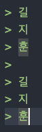

<p align="center"></p>

# 마크다운
마크다운(Markdown)은 일종의 문법이다.  
깃헙에 TIL 정리를 자주 하게되어서 조금 익숙해졌지만   
아직도 자주 까먹고 검색을 자주해서 필수인 것들만 정리해보려한다!

## 1. 타이틀 크기 조정

h1 ~ h6라고 한다.  
#의 개수가 많아질수록 작아진다고 보면된다!
### 마크다운 문법
~~~
# h1
## h2
### h3
#### h4
##### h5 
###### h6
~~~
> # h1
> ## h2
> ### h3
> #### h4
> ##### h5
> ###### h6
> ####### h7 (얜 없음)

## 2. 인용문  
블록을 나눈다고 생각하면 된다!
### 마크다운 문법
~~~
> 인용하기
>> 인용의 인용하기
>>> 인용의 인용의 인용하기
~~~
> 인용하기
>> 인용의 인용하기
>>> 인용의 인용의 인용하기

## 3. 줄바꾸기
글을 쓰다가 다음행으로 넘어가고 싶으면 보통 엔터키를 한 번 치고 아래로 내려가는데
마크다운은 한 번의 엔터로는 불가능하다.
### 마크다운 문법
~~~
글을 쓰다가 다음행으로 가고싶을때 : 스페이스바 두 번 + 엔터
아니면 <br/>를 뒤에 붙이면 됨~~
~~~
> 길
> 지
> 훈
>
> 길  
> 지  
> 훈



위 인용문의 내용은 같은 위치에 입력을 했지만, 스페이스바 두 번을 안했고 했고의 차이가 존재한다는 것!

## 4. 목록

### 4.1 순서있는 목록
### 마크다운 문법
~~~
1. 첫번째
2. 두번째
3. 세번째
~~~
1. 첫번째
2. 두번째
3. 세번째
### 4.2 순서있는 목록
### 마크다운 문법
~~~
* 첫번째
    * 두번째
        * 세번째
~~~
* 첫번째
    * 두번째
        * 세번째

## 5. 코드 블럭
### 마크다운 문법
~~~
```(여기에 특정언어를 써서 강조도 가능 ex. swift)
!여기에 코드작성!
```

'~~~'(여기에 특정언어를 써서 강조도 가능 ex. swift)
!여기에 코드작성!
'~~~'(''제거)

~~~

```swift
let
```

## 6. 인라인 코드
### 마크다운 문법
~~~
`인라인 코드 생성!`
~~~

`인라인 코드 생성!`

## 7. --- 수평선 ---
### 마크다운 문법
~~~
* * *
***
*****
- - -
-------------------
<hr/>
~~~

* * *
***
*****
- - -
----------
<hr/>

## 8. 표 만들기
헤더 셀을 구분할 때 3개 이상의 -(하이픈) 기호
### 마크다운 문법
~~~
| 첫번째(기본왼쪽정렬) | 두번째(가운데정렬) | 세번째(오른쪽정렬) |
|---|:---:|---:|
| `왼쪽` | 정렬확인1 | abc |
| `정렬` | 정렬확인2 | abcdefgh |
| `123` | 정렬확인,정렬확인,정렬확인 | abcdef |
| `456` | 정렬확인1234 | abc |
~~~

### 결과
| 첫번째(기본왼쪽정렬) | 두번째(가운데정렬) | 세번째(오른쪽정렬) |
|---|:---:|---:|
| `왼쪽` | 정렬확인1 | abc |
| `정렬` | 정렬확인2 | abcdefgh |
| `123` | 정렬확인,정렬확인,정렬확인 | abcdef |
| `456` | 정렬확인1234 | abc |

## 9. 강조
이탤릭체, 볼드, 및줄, 취소선, jay park lets go.

### 마크다운 문법
~~~
*이탤릭체*
_이탤릭체_
**볼드**
__볼드__
***이탤릭+볼드***
___이탤릭+볼드___
~~cancel line~~~
**~~볼드 + cancel line~~**
<u>밑줄</u>
~~~

*이탤릭체*<br/>
_이탤릭체_<br/>
**볼드**<br/>
__볼드__<br/>
***이탤릭+볼드***<br/>
___이탤릭+볼드___<br/>
~~cancel line~~~<br/>
**~~볼드 + cancel line~~**<br/>
<u>밑줄</u><br/>

## 10. 링크

인라인 링크, URL 링크 
### 10.1 인라인
### 마크다운 문법
~~~
[길지훈의 깃허브](https://github.com/giljihun)

* 참조 링크법
Link : [길지훈의 깃허브][gilhub]
[gilhub]: https://github.com/giljihun
~~~

[길지훈의 깃허브](https://github.com/giljihun)

* 참조 링크법
Link : [길지훈의 깃허브][gilhub]

[gilhub]: https://github.com/giljihun


### 10.2 URL
### 마크다운 문법
~~~
<https://github.com/giljihun>
~~~
<https://github.com/giljihun>

## 11. 이미지
### 11.1 이미지 삽입
### 마크다운 문법
~~~

~~~


### 11.2 이미지 크기 및 정렬 조절
### 마크다운 문법
~~~


~~~


<br/> 
이미지 정렬 조정은 img 태그를 p 태그로 감싸준다.
~~~

~~~
<p align="center"> ... </p>
~~~ 

<p align="center"></p>
